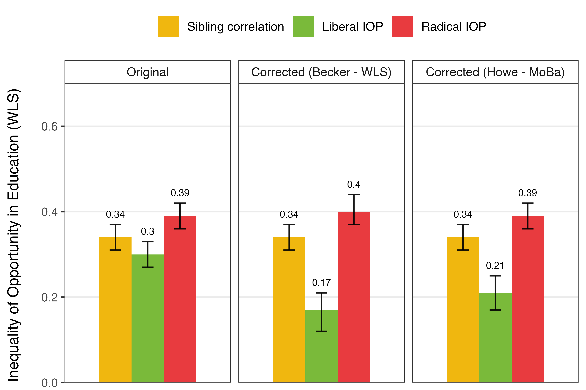
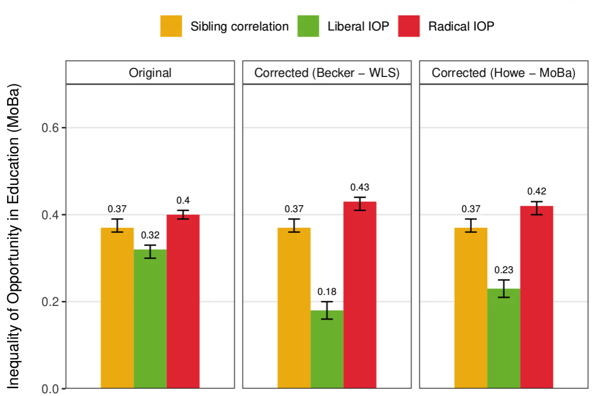
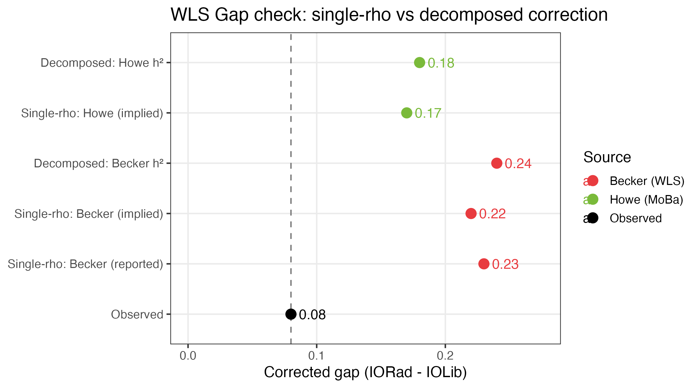
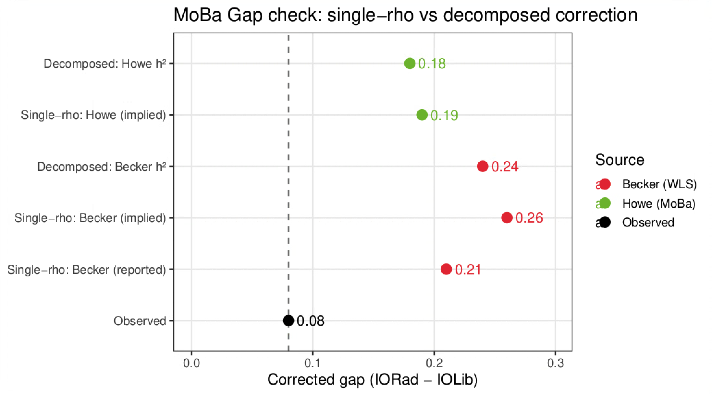

# PGI-RC Correction: Results

## Corrected inequality of opportunity estimates

The correction substantially reduces IOLib — because the noisy PGI currently over-attributes variance to shared family environment — and modestly increases IORad through within-family variance. The gap roughly doubles when corrections are applied. The effect size of the correction is consistent with Becker et al. (2021), see Table 3 in their paper for an example of correction.

### WLS

|  | $h^2_\text{between}$ | $h^2_\text{within}$ | $\rho_\text{between}$ | $\rho_\text{within}$ | Sibcorr | IOLib | IORad | Gap |
|--|---------------------|--------------------|-----------------------|---------------------|---------|-------|-------|-----|
| Original | — | — | — | — | 0.34 | 0.30 | 0.39 | 0.09 |
| Corrected (Becker – WLS) | 0.119 | 0.053 | 1.939 | 1.255 | 0.34 | 0.17 | 0.40 | 0.23 |
| Corrected (Howe – MoBa) | 0.090 | 0.040 | 1.686 | 1.091 | 0.34 | 0.21 | 0.39 | 0.18 |

*WLS data parameters: $R^2_\text{between} = 0.094$, $R^2_\text{within} = 0.051$, ICC $= 0.337$, $R^2_\text{pop} = 0.065$.*

### MoBa

|  | $h^2_\text{between}$ | $h^2_\text{within}$ | $\rho_\text{between}$ | $\rho_\text{within}$ | Sibcorr | IOLib | IORad | Gap |
|--|---------------------|--------------------|-----------------------|---------------------|---------|-------|-------|-----|
| Original | — | — | — | — | 0.37 | 0.32 | 0.40 | 0.08 |
| Corrected (Becker – WLS) | 0.119 | 0.053 | 1.752 | 1.975 | 0.37 | 0.18 | 0.43 | 0.25 |
| Corrected (Howe – MoBa) | 0.090 | 0.040 | 1.523 | 1.717 | 0.37 | 0.23 | 0.42 | 0.19 |

*MoBa data parameters: $R^2_\text{between} = 0.104$, $R^2_\text{within} = 0.022$, ICC $= 0.374$, $R^2_\text{pop} = 0.052$.*

---

## Check: single-$\rho$ vs. decomposed correction

The decomposed correction ($\rho_\text{between}$, $\rho_\text{within}$ separately) used to compute the corrected version of each index should be consistent with a check where a single $\rho_\text{pop}$ scales the radical-liberal gap, accounting for the total genetic contirbution (between and within families): 

$$\text{IORad}_\text{RC} - \text{IOLib}_\text{RC} = \rho^2_\text{between}\,\Delta_\text{between} + \rho^2_\text{within}\,\Delta_\text{within} = \rho^2_\text{pop}\,\Delta_\text{observed}$$

Single $\rho_\text{pop}$ is either:
- implied from the data, using $h^2_\text{pop}$ values reported in Becker et al (2021), and in Howe et al (2022)
- taken as directly reported in Becker et al (2021)

The gap check validates the decomposed correction. In **WLS** the decomposed Becker result (0.24) matches Becker's directly reported $\rho = 1.649$ exactly, and is close to the implied single-$\rho$ value (0.23). The Howe decomposed result (0.18) is also close to the Howe single-$\rho$ check (0.17). This internal consistency confirms that the between/within decomposition of $\rho$ is coherent with the population-level estimate.

In **MoBa** the match is looser for Becker: the decomposed result (0.24) sits between the reported single-$\rho$ (0.21) and the implied single-$\rho$ from our $R^2_\text{pop}$ (0.26). The Howe decomposed result (0.18) matches the Howe single-$\rho$ (0.19) closely. The small discrepancy for Becker in MoBa reflects the fact that Becker's $h^2$ estimate is WLS-specific and the $R^2$ is estimated in MoBa, introducing a cross-study mismatch for that scenario.

### WLS

| Method | Corrected gap |
|--------|--------------|
| Observed | 0.09 |
| Single-$\rho$: Becker (reported, $\rho = 1.649$) | 0.24 |
| Single-$\rho$: Becker (implied from our $R^2_\text{pop}$) | 0.23 |
| **Decomposed: Becker $h^2$** | **0.24** |
| Single-$\rho$: Howe (implied from our $R^2_\text{pop}$) | 0.17 |
| **Decomposed: Howe $h^2$** | **0.18** |

### MoBa

| Method | Corrected gap |
|--------|--------------|
| Observed | 0.08 |
| Single-$\rho$: Becker (reported, $\rho = 1.649$) | 0.21 |
| Single-$\rho$: Becker (implied from our $R^2_\text{pop}$) | 0.26 |
| **Decomposed: Becker $h^2$** | **0.24** |
| Single-$\rho$: Howe (implied from our $R^2_\text{pop}$) | 0.19 |
| **Decomposed: Howe $h^2$** | **0.18** |

