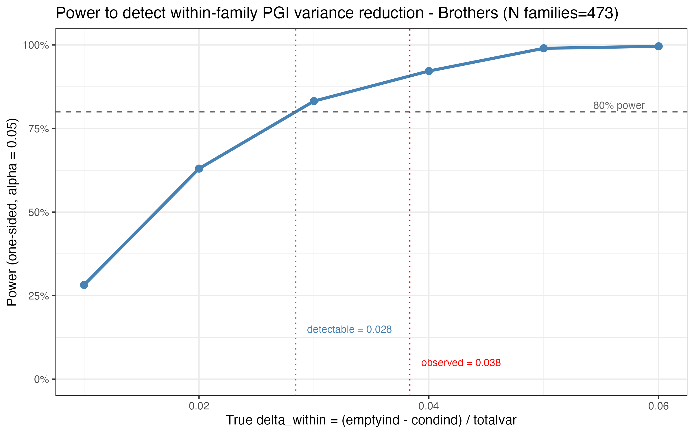
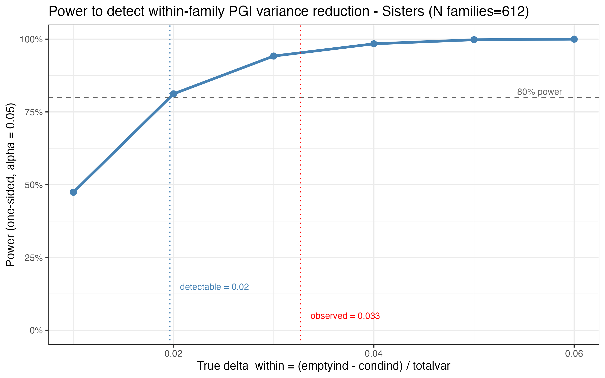
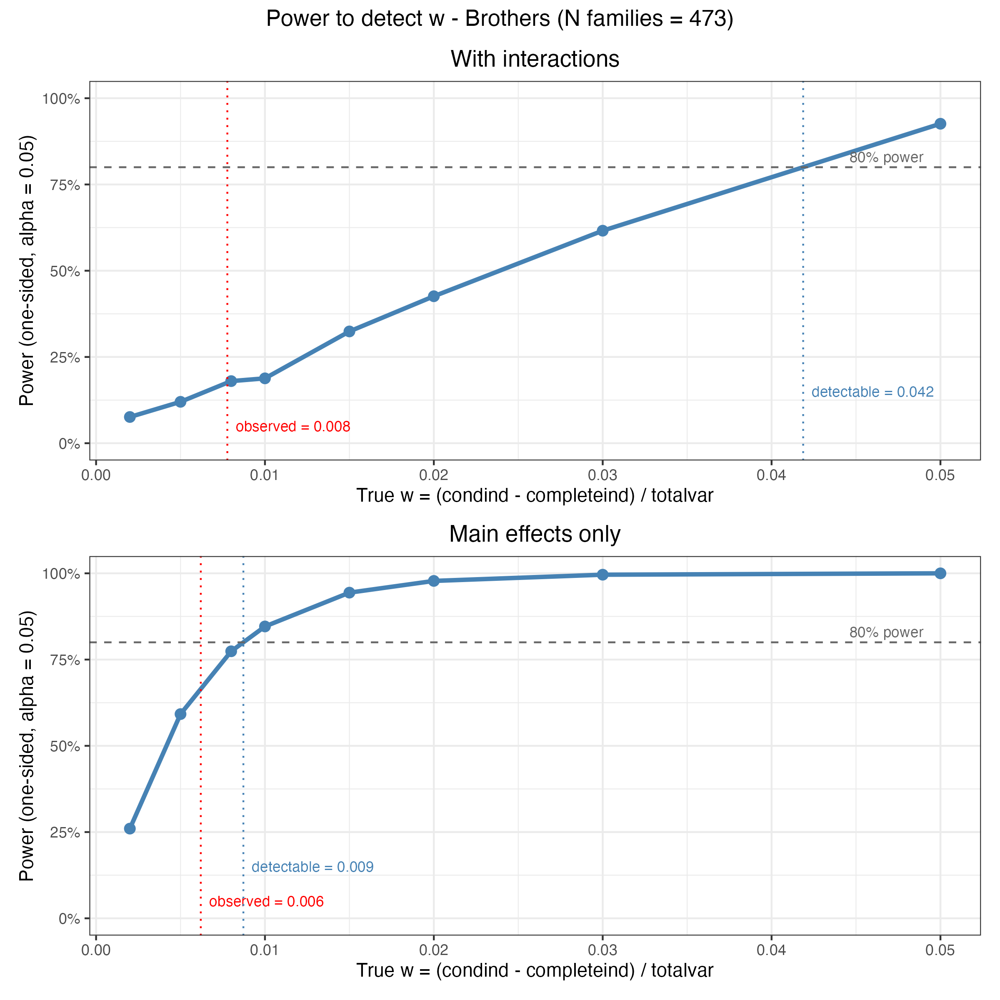
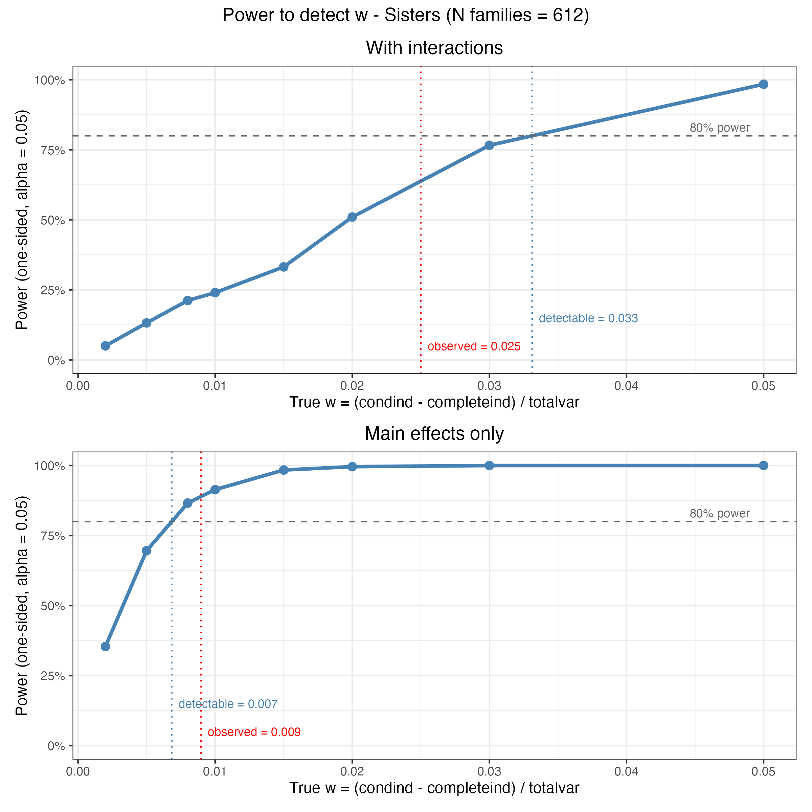
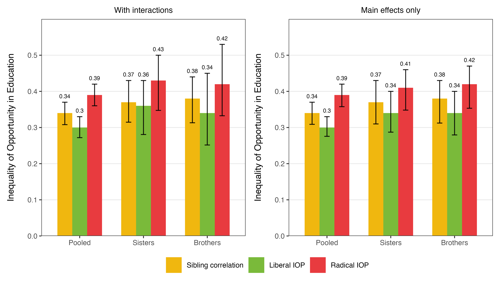

# Power Analysis — Results

All simulations: n_sim = 500 replications, one-sided alpha = 0.05. In the simulated data PGI signal is concentrated in pgi_education, results are the same if the PGI signal is equally shared across PGI variables.

---

## 1. Detect within family variation in PGI

Recall:
*  `delta_within = (emptyind − condind) / totalvar`.
* Null: delta_within = 0.

Both brothers and sisters samples are well powered to detect delta_within at the observed magnitude.

**Brothers** 

**Sisters**

## 2. Detect within family variation in ascribed characteristics controlling for PGIs

Recall:
* `w = (condind − completeind) / totalvar`.
* Null: w = 0 conditional on PGIs present in m1. 

#### Power with full interaction models
The models are severly underpowered to detect the observed w in both brothers and sisters (see panels "With interactions" in [Figure 3](#fig3) and [Figure 4](#fig4)). Thus, I recomputed the power curves including only PGIs and ascribed characteristics main effects, instead of including all their interactions as in the main analysis. 

#### Main results with no interactions
To do so, I first recomputed the main analyses with main effects only, results are shown in [Figure 5](#fig5). Including main effects only, the resulting indices as well as w and delta_within are nearly identical for the pooled and the brother samples. For sisters, iolib and iorad indices are slightly lower and now converge towards the brothers results. This is likely due to the large drop in w (0.025 with interactions, 0.009 without), which might have been caused by overfitting. In the sex stratified samples confidence intervals are sizeably smaller.

#### Power with no interaction models
See panels "Main effects only" in [Figure 3](#fig3) and [Figure 4](#fig4).
When only main effects are included, power is around 70% for brothers (still under 80% but well above the fully interacted specfication), and is now above 80% for sisters. This means that at these low sample sizes interactions largely reduced power to detect this variance component. 

**Fig 3: Brothers**

**Fig 4: Sisters**

---

## 3. Main Results: Full Interactions vs. Main Effects Only

Pooled sample estimates and SE are unaffected by the exclusion of the interactions. Sex stratified analyses gain in precision. Point estimates do not change for brothers, and slighlty reduce for sisters, possibly due to an inflated w estimated in the underpowered fully interacted model.

**Figure 5**

**Point estimates**

| Sample | Spec  | delta_within | w | 
|--------|--------:|------------:|------:|
| Brothers | full int  | 0.038 | 0.008 | 
| Brothers | main only   | 0.036 | 0.006 | 
| Sisters  | full int  | 0.033 | 0.025 | 
| Sisters  | main only    | 0.027 | 0.009 |
| Pooled   | full int | 0.034 | 0.018 |  
| Pooled   | main only    | 0.031 | 0.018 | 

